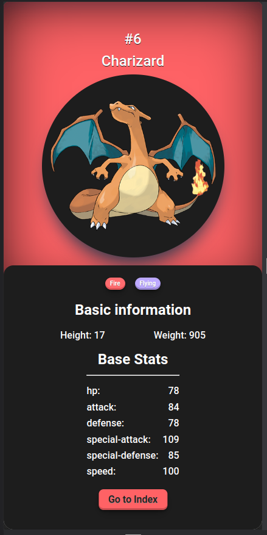
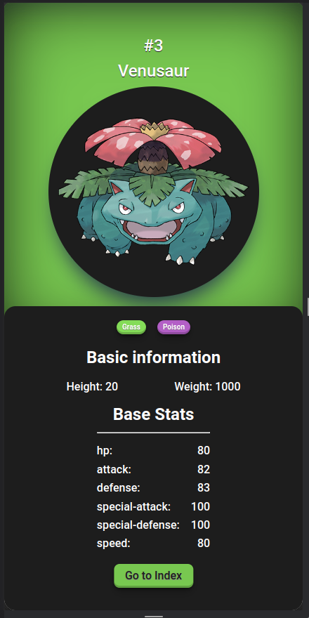

# Trilha JS Developer - Pokedex

Repositório referente à entrega do projeto pokedex da trilha de JS do bootcamp Santander 2023 - Fullstack Java + Angular, onde foi aplicado conceitos de HTML, CSS e principalmente Javascript.

### O que foi feito no projeto?

Seguindo as aulas, foi montado uma pokedex básica e o desafio proposto era criar os detalhes do pokemon, seja nos próprios cards ou em uma nova página. Eu optei pela segunda opção.

 

acima pode ser vistos imagens do resultado final dessa nova página, que pode ser acessada clicando no botão "Details" direto do card da pokedex no index.html ou acessando através da url direta do arquivo PokemonDetailPage.html seguido da query string com o id do pokemon desejado, ficando da seguinte forma:

> /PokemonDetailPage.html?id=1

A página é inteiramente alimentada de forma dinamica através do javascript, desde o fundo, quanto as imagens, informações e botão.
